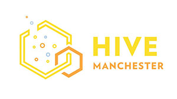

# HackManchesterYouthHacks

Manchester Social Entrepreneurs Challenge - Hack Manchester Junior Half Term Youth Hacks 2016

 

## Background

[Manchester Social Entrepreneurs](http://www.meetup.com/Manchester-Social-Entrepreneurs/) Manchester Social Entrepreneurs was started a year and a half ago. A social entrepreneur is someone who starts a business with the core aim, and focus, of helping to change the world and help society. We exist to help grow the Manchester Social Entrepreneur community, offer support to people to who are trying to help change the world and bring in key social enterprise speakers to inspire future entrepreneurs.

## The Challenge

Home recycling is a massive problem in today’s society. We’re pushed to recycle but it’s not made easy. How can we use existing technology to help encourage families to recycle more efficiently and effectively? Could this be monetised or incentivised? Let’s help keep our world sustainable!

## Tips

Tips: Social Enterprise UK is the best place to start your research. It’ll help you figure out what a social enterprise is and how you can be involved.

Also, a handy tip is figure out what problem in your community that bothers you and try and think of a tech solution. Then you have a social enterprise on your hands!

## The prizes

TBC

